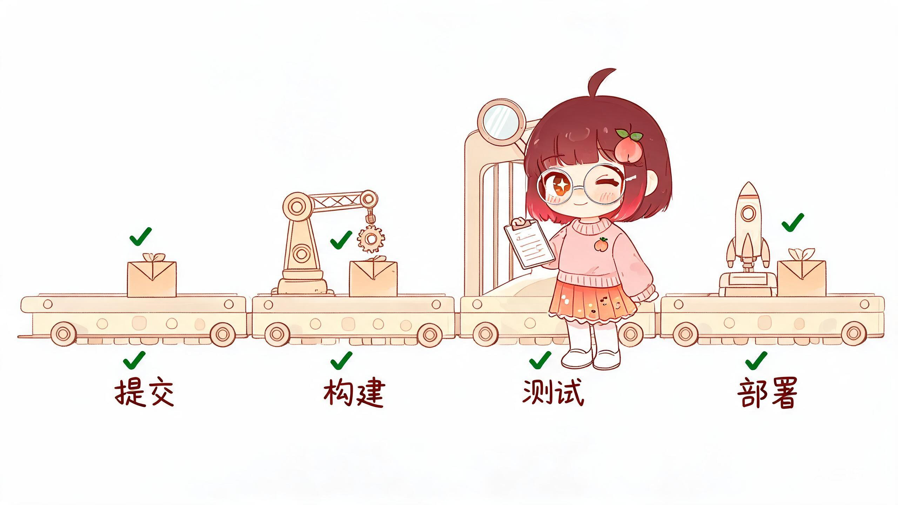
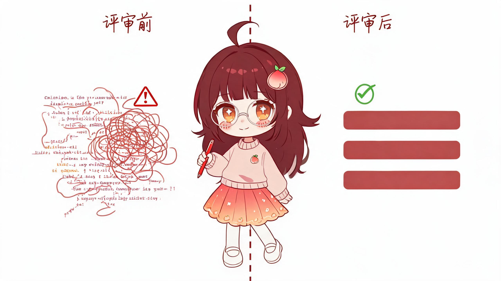
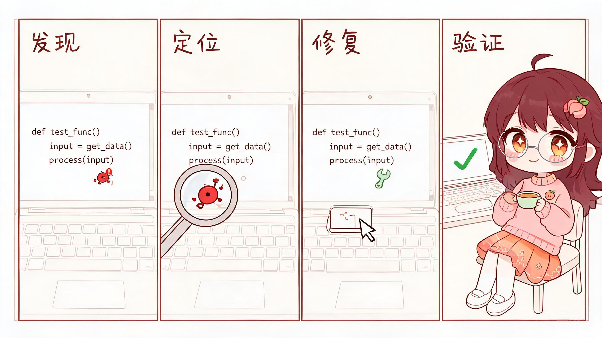

# XiaoTao Illustrations · 小桃配图

把中文文章里的判断、流程、状态和隐喻，变成一张张净白淡彩、有小桃参与的 16:9 正文配图。

净白淡彩 | 小桃 IP | 编程技术隐喻 | 准确严谨又轻松 | Trae Skill

## 这个仓库是什么

XiaoTao Illustrations 是一个 Trae Skill，用来指导 AI Agent 为中文文章、帖子、博客、文档和技术内容生成正文配图。

它不是通用插画 prompt，也不是 PPT 信息图模板。它的核心目标是：先准确理解文章里的认知锚点，再把其中一个判断、流程、结构、状态或隐喻，变成一张有记忆点的 16:9 浅色水彩解释图。

默认视觉 IP 是"小桃"：一个 Q 版棕发、圆银框眼镜、桃子发夹的程序员女孩。小桃不是吉祥物，不是贴纸，也不是站在角落里的装饰物，而是正在认真参与系统运转的、轻松但严谨的工作者。

一句话：**让 AI 不只是"配一张图"，而是让小桃把文章里的一个关键认知动作画出来。**

构图第一原则是**准确**：隐喻必须精确对应认知锚点，宁可简化，不可画错。检验标准：读者只看图和标注词、不看原文，能猜出原句意思且不会猜偏。

## 适合谁用

特别适合：

- 写中文技术文章，需要正文配图和文章插图的人
- 做知识型内容、方法论内容、AI 工作流内容的人
- 想把抽象判断画成准确的编程/技术隐喻的人
- 想要一种比 PPT 信息图更轻、更有个人识别度的配图风格的人
- 用 Trae 做内容生产，希望稳定复用一套视觉语言的人

不适合：

- 想要商业插画、品牌 KV 或精致扁平插画的人
- 想要传统 PPT 信息图、复杂架构图或流程图的人
- 想要儿童卡通、可爱 IP、表情包风格的人
- 想把大量正文、长段解释或完整课程页塞进一张图里的人
- 需要严格可编辑矢量源文件的人

## 它会产出什么

默认输出：

- 16:9 横版正文配图
- 一篇文章的 4-8 张 shot list
- 每张图的主题、核心意思、构图类型、小桃动作和中文标注建议
- 最终 PNG 图片，保存到 workspace 的 `assets/<article-slug>-illustrations/`

默认不输出：

- PPTX / PDF / Keynote
- SVG / HTML / Canvas 可编辑图
- 商业海报或封面 KV
- 大段文字型信息图

## 视觉风格

这个 skill 默认使用"小桃净白淡彩正文配图"风格（2026-08-21 实测校准）：

- 净白底 + 奶油色块 + 玫瑰粉 + 深棕红锚点（IP 发色），低饱和但颜色清晰在场
- 清晰棕色细线（干净墨线感，不糊不晕染），浅水彩淡彩着色
- 大量留白，极简构图，默认零贴纸装饰
- 编程/技术隐喻：终端、调试、架构、CI/CD、代码日常
- 小桃必须参与核心动作，不能只是装饰
- 准确、严谨、轻松，但不幼稚、不卖萌

## 实测样例

8 种构图类型全部实测校准通过（2560×1440，详见 [xiaotao-illustrations/assets/examples/EXAMPLES.md](xiaotao-illustrations/assets/examples/EXAMPLES.md)）：

| 构图类型 | 概念 | 图片 |
|---|---|---|
| 概念隐喻 | 重构是飞行中换引擎 | [](examples/images/test-refactor-engine-swap-v2.jpg) |
| Workflow 流水线 | CI/CD 从提交到部署 | [](examples/images/test-cicd-pipeline-v2.jpg) |
| 前后对比 | 代码评审前后 | [](examples/images/test-code-review-before-after-v2.jpg) |
| 方法分层 | 技术栈三层结构 | [](examples/images/test-tech-stack-layers-v2.jpg) |
| 小漫画分镜 | debug 四步小剧场 | [](examples/images/test-debug-comic-strip-v2.jpg) |
| 角色状态 | 信息过载但情绪稳定 | [](examples/images/test-bug-overflow-calm-v1.jpg) |
| 系统局部 | 给数据库加索引 | [](examples/images/test-database-index-v1.jpg) |
| 地图路线 | 新手到交付成长路线 | [](examples/images/test-learning-roadmap-v1.jpg) |

风格量化基准（供生成后复测）：亮度 90-96%、饱和度 3-10%、净白底 44-74%、玫瑰粉主色 #B8908C~#D9BDB5。

## 安装

克隆仓库：

```bash
git clone <repo-url>
cd xiaotao-illustrations
```

复制 skill 到 Trae skills 目录：

```bash
mkdir -p ~/.trae-cn/skills
cp -R ./xiaotao-illustrations ~/.trae-cn/skills/
```

安装后，在 Trae 里使用：

```text
用 xiaotao-illustrations 为这篇中文文章设计并生成 5 张小桃正文配图。
```

## 怎么用

### 只做配图规划

```text
用 xiaotao-illustrations 先不要生图。
请分析下面这篇文章哪里值得配图，输出 5 张左右的 shot list。
每张图写清楚：放在哪段后、主题、核心意思、构图类型、小桃在做什么、建议中文标注词。

<粘贴文章>
```

### 直接生成正文配图

```text
用 xiaotao-illustrations 把下面这篇文章生成 4 张小桃正文配图。
要求：16:9 横版、浅色水彩风、小桃轻松但严谨地承担核心动作。

<粘贴文章>
```

### 为单个概念生成一张图

```text
用 xiaotao-illustrations 为"信任不是喊出来的，而是一块证据一块证据铺过去"生成一张正文配图。
小桃必须承担核心动作，编程/技术场景，隐喻要准确。
```

### 为技术内容生成配图

```text
用 xiaotao-illustrations 为这段关于 debug/架构/部署/重构 的内容生成 3 张小桃配图。
小桃要轻松但精准地搞定技术问题。
```

更多示例见 [examples/prompts.md](examples/prompts.md)。

## 工作流程

这个 skill 的流程是：

1. 读取文章、Markdown、截图或用户给的主题
2. 提炼核心观点、认知转折、流程结构和适合视觉化的段落
3. 先输出 shot list：每张图只选一个认知锚点，隐喻逻辑链写全
4. 为每张图选择构图类型：Workflow、系统局部、前后对比、角色状态、概念隐喻、方法分层、地图路线或小漫画分镜
5. 发明一个准确的编程/技术隐喻，画面结构与概念逻辑一一对应
6. 让小桃承担核心动作
7. 每张图单独调用图像模型生成（16:9，2560×1440）
8. 按 QA 清单检查：内容准确性、角色一致性、肢体、画风、文字、规格
9. 如需精确中文标注且模型直绘错字，用包内字体程序叠字
10. 保存最终 PNG，并报告用途和路径

## 目录结构

```text
.
├── README.md
├── LICENSE
├── examples/
│   ├── images/
│   └── prompts.md
└── xiaotao-illustrations/
    ├── SKILL.md
    ├── assets/
    │   ├── examples/          # 风格校准样例图 + EXAMPLES.md 索引
    │   └── fonts/             # 内置字体（不依赖本地环境）
    │       ├── LXGWWenKai-Regular.ttf
    │       ├── JetBrainsMono-Regular.ttf
    │       └── OFL-Licenses.md
    └── references/
        ├── style-dna.md
        ├── character-ip.md
        ├── composition-patterns.md
        ├── prompt-template.md
        └── qa-checklist.md
```

真正需要安装到 Trae 的是子目录：

```text
xiaotao-illustrations/
```

根目录的 README、LICENSE 和 examples 是 GitHub 分享文档。

## 内置字体（重要）

本 Skill 内置两个 SIL OFL 1.1 开源字体（`assets/fonts/`），渲染文字时使用包内字体，**不依赖用户本地环境**：

- 霞鹜文楷（LXGW WenKai）——中文手写风标注
- JetBrains Mono——代码/等宽标注

字体许可证原文随包分发（`assets/fonts/OFL-Licenses.md`）。

## 注意事项

- 图片里的中文文字越短越稳定，标注词优先从原文提取原词。
- 每张图只讲一个核心结构，不要把文章做成说明书。
- 小桃必须承担核心动作；如果去掉小桃画面仍然完全成立，说明小桃太装饰了。
- AI 图像模型可能出现错字、幻觉标签、肢体畸变、风格漂移或多余标题，生成后必须按 QA 清单检查。
- 如果中文错字严重，优先减少标注词并重生成，或改用包内字体程序叠字。

## 相关项目

- [ian-xiaohei-illustrations](https://github.com/helloianneo/ian-xiaohei-illustrations) —— 本项目的灵感来源，小黑怪诞手绘配图 Codex Skill

## License

MIT License. See [LICENSE](LICENSE). 内置字体遵循各自的 SIL OFL 1.1 许可证。
